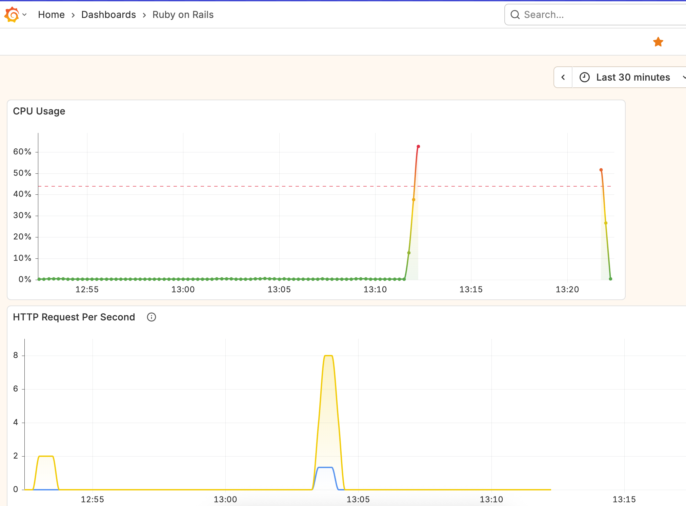
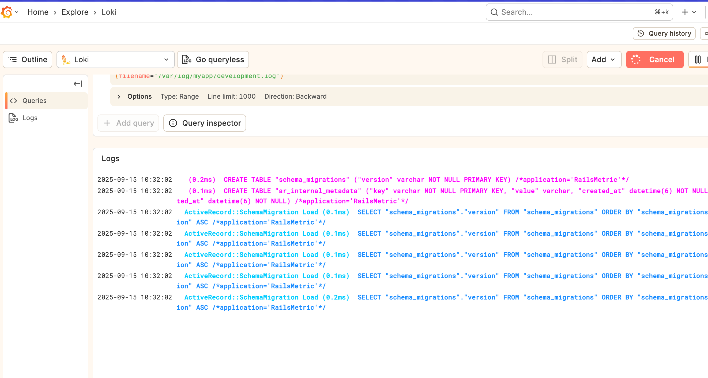

# Rails Metric Observability

This repository is created for learning observability in Ruby on Rails applications.





## Stack

- Ruby on Rails
- SQLite
- Docker (Prometheus, Grafana, Loki, Promtail, Node Exporter, Rails Exporter)

## How to Run

1. Make sure Docker is installed on your machine.
2. Open your terminal and run the following command:

	```bash
	docker-compose up -d
	```

3. Access Grafana and Prometheus via your browser according to the configuration in `docker-compose.yml`.

4. Done